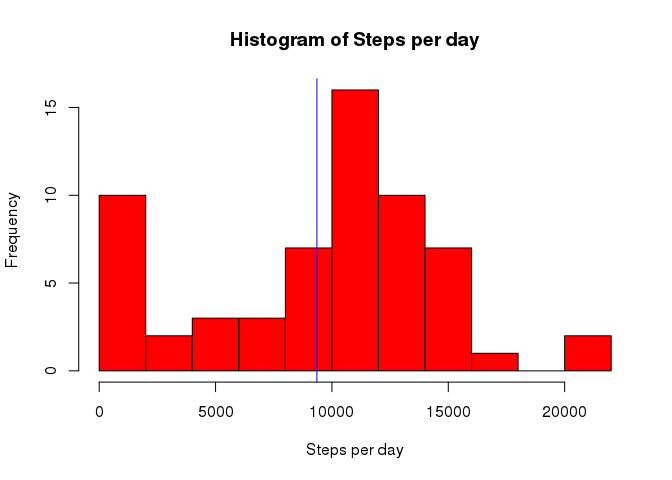
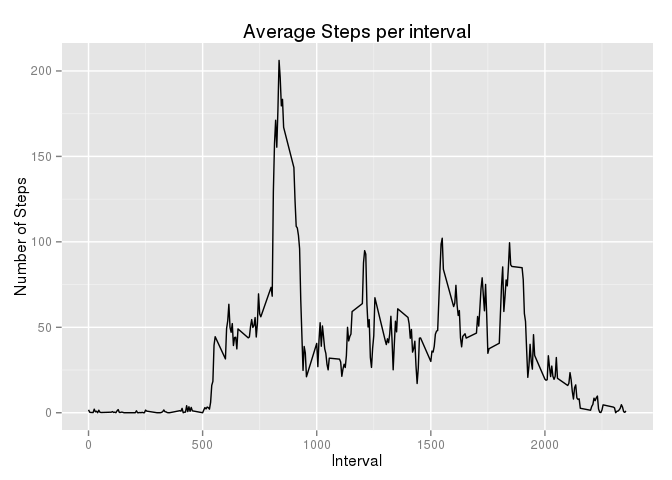
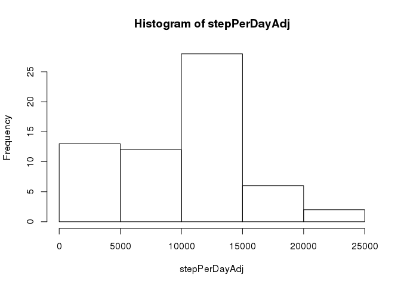
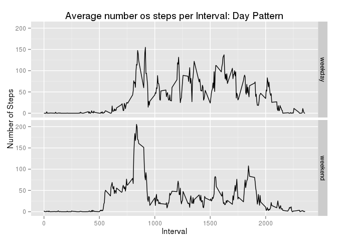

# Reproducible Research: Peer Assessment 1


## Loading and preprocessing the data

The data is loaded and data and time objects are created.


```r
data<-read.csv(unz("activity.zip","activity.csv"))
data$time<-as.POSIXct(strptime(paste(data$date,formatC(data$interval,digits=3,flag="0")),"%Y-%m-%d %H%M",tz="UTC"))
data$date<-as.Date(data$date,"%Y-%m-%d")
```


## What is mean total number of steps taken per day?


```r
stepPerDay<-tapply(data$steps,data$date,sum,na.rm=TRUE);
hist(stepPerDay)
```

 

```r
mean(stepPerDay)
```

```
## [1] 9354.23
```

```r
median(stepPerDay)
```

```
## [1] 10395
```

The mean steps per day is 9354.2295082 and the median is 10395.

## What is the average daily activity pattern?


```r
stepPerInterval<-tapply(data$steps,data$interval,mean,na.rm=TRUE);
plot(as.numeric(names(stepPerInterval)),stepPerInterval,type="l")
```

 

```r
names(which.max(stepPerInterval))
```

```
## [1] "835"
```

The interval 835 has an average of 206.1698113, that is the maximum interval average.

## Imputing missing values

There are only missin value on steps and they are 2304.

```r
summary(data)
```

```
##      steps             date               interval     
##  Min.   :  0.00   Min.   :2012-10-01   Min.   :   0.0  
##  1st Qu.:  0.00   1st Qu.:2012-10-16   1st Qu.: 588.8  
##  Median :  0.00   Median :2012-10-31   Median :1177.5  
##  Mean   : 37.38   Mean   :2012-10-31   Mean   :1177.5  
##  3rd Qu.: 12.00   3rd Qu.:2012-11-15   3rd Qu.:1766.2  
##  Max.   :806.00   Max.   :2012-11-30   Max.   :2355.0  
##  NA's   :2304                                          
##       time                    
##  Min.   :2012-10-01 00:00:00  
##  1st Qu.:2012-10-16 05:58:45  
##  Median :2012-10-31 11:57:30  
##  Mean   :2012-10-31 11:57:30  
##  3rd Qu.:2012-11-15 17:56:15  
##  Max.   :2012-11-30 23:55:00  
## 
```

```r
sum(is.na(data$steps))
```

```
## [1] 2304
```

```r
auxData<-aggregate(data$steps,by=list(data$interval),FUN = median,na.rm=TRUE)
names(auxData)<-c("interval","median.steps")
auxData<-merge(data,auxData)
auxData$steps[is.na(auxData$steps)]<-auxData$median.steps[is.na(auxData$steps)]

stepPerDayAdj<-tapply(auxData$steps,auxData$date,sum,na.rm=TRUE);
hist(stepPerDayAdj)
```

 

```r
mean(stepPerDayAdj)
```

```
## [1] 9503.869
```

```r
median(stepPerDayAdj)
```

```
## [1] 10395
```

The adjusted mean steps per day is 9503.8688525 and the median is 10395.


## Are there differences in activity patterns between weekdays and weekends?


```r
Sys.setlocale("LC_TIME", "C");
```

```
## [1] "C"
```

```r
data$weekday=as.factor(ifelse(weekdays(data$time,abbreviate = TRUE) %in% c("Sat","Sun"),"weekday","weekend"));
data$weekday=relevel(data$weekday,"weekday")
auxData<-aggregate(steps~interval+weekday,data=data,FUN = mean,na.rm=TRUE)
library(lattice)
xyplot(steps~interval|weekday,auxData,layou=c(1,2),type="l")
```

 

